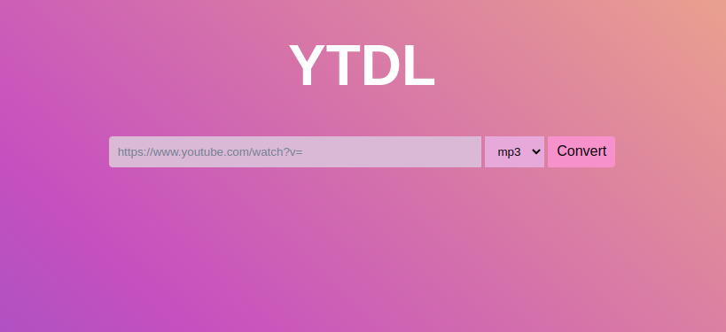

# YTDL

## A YouTube Downloader based on JavaScript and HTML

### By Serguei V, Swann M, and Luis BLZ

## Who did what

Written in the ***Project*** Tab [here](https://github.com/users/SwannMrn/projects/1)

## Installation

Download the release for your system (it's on the right, or [here](https://github.com/SwannMrn/YTDL/releases)).

Execute the ***setup.bat*** file in the main folder.

**Done!** To start the website, execute ***start.bat***.

## How we did it

We made a local server (URL is ***localhost:5000***) using NodeJS, npm and Express (basically JavaScript). In the ***public*** directory made a HTML file with an input, a aselector and a button. We styled it with a bit of CSS.

In the main directory, there is ***app.js***, which launches and sends the files in the server for use and displays the ***index.html*** file, along with the CSS and the JavaScript.

***script.js*** is the file linked to the ***index.html*** file, which collects the YouTube link in the **text input**.

Then, the link is used with the **ytdl-core** JavaScript module, which downloads the video, which is pushed to the server.

The ***script.js*** file also contains 3 functions: one for "listening" for an input in the text bar when the button is pressed, and runs one of the 2 functions:

**downloadMp3** or **downloadMp4**, which creates an element, and sets a link to that document (href), with a **download** attribute (which sets the link to not display and just download a file).

Once the link is prepared, the ***app.js*** file then **gets** the url, validates it with **ytdl.validateurl**, sets the title of the file, gets the video info and sets it as the **header** of the file (basically it's description and author, etc...), and finally downloads the video using the **ytdl(url)** function and **pipe** to send it to the server.

***NB:*** the **title** lines (at app.js line 29 and 54) use the functions to get the title of the video, and delete a weird string that is sometimes in the title of the file. I found this line of code on StackOverflow, as I didn't know why it happened.

The video is deleted once the console is closed/the server is closed (**Ctrl+c** to kill program in the shell).

There it is! It works!

NB: We also have a mp3 option to download the audio, which uses the same process, except ytdl-core takes the **mp3** argument to download the audio only.

Note that the only quality available for videos is 720p.

## Pros:

The download speed is much speedier than on other websites, since YOU host the server (localhost), it has no capping for download speed. I usually download a 10-15 minutes video in 10 seconds, but it depends of your computer and I teener speed.

There are no ads, no limits to how much videos you can download, and it will always work as long as the **ytdl-core** module is kept up to date!

